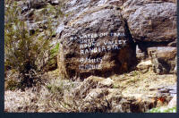

## Trails

The following are trails I am familiar with. It has been about twenty years 
since I have been to any of these except I have been to Mission Point relatively recently.

### Mission Point

Mission Point is near O&#39;Melveny Park in Granada Hills. There are two trails starting from O&#39;Melveny Park.

Prior to discovering the Grotto Trail (below) I usually used the Dr. Mario A. DeCampos Trail. Actually I usually went up next to the gas pipeline; that route begins and ends at the same place but is a direct way up most of the way. Many of the pictures of the trailhead are mine and so are many for the peak.

I have discovered a trail called the Grotto Trail that begins near the caretaker&#39;s residence and goes straight up. If you keep to the left when you walk past the park entrance then after getting past the Grapefruit orchard you will see a sign in a square thing made of rock and cement saying &quot;Grotto Trail&quot;. It is a well-used trail.

### Gabrielino Trail (along the Arroyo Seco and the Angeles Crest Highway)

This is the easiest of the trails listed here. The trailhead is on
N Windsor Ave where it changes names and becomes Ventura Steet near Jet Propulsion Laboratories (JPL) in Pasadena. The other end of the Gabrielino Trail is Chantry Flats, nearly 30 miles, but I am not suggesting going all the way. You can go as far along the Arroyo Seco as you want or you can go all the way up to Switzer Picnic area or you can go all the way to Red Box. Red Box is at the intersection of Angeles Crest Higway and the Mount Wilson Red Box Road.

The beginning of the Gabrielino Trail goes alongside the Arroyo Seco river. The Angeles Crest Highway is nearby, alongside and above the trail but too far to be seen. The beginning of the trail is paved. Near the 
beginning of the trail are cabins where Forest Rangers live but you are likely to not notice that. The trail passes by the Gould Mesa Campground. The trail is nearly flat until it gets to a section alongside a dam, then the trail is a little steep for a way. You are not able to see the dam. Then the trail passes by Oakwilde campground. After Oakwilde campground the trail turns away from the Arroyo Seco and goes up. After a while it gets to the Switzer Falls area. Be careful which direction you go. If you go one way then you go downstream from the falls. If you go the other way then you go to the Switzer Picnic area, upstream from the falls. Either way you eventually go down to the Arroyo Seco.

See [Los Angeles Top Trails - Arroyo Seco](http://www.gorp.com/weekend-guide/travel-ta-hiking-los-angeles-sidwcmdev_058914.html)
for details. See [Dan's Hiking Pages: Arroyo Seco](http://www.simpsoncity.com/hiking/arroyoseco.html)
and [LocalHikes - Lower Arroyo Seco](http://www.localhikes.com/Hikes/LowerArroyoSeco_4472.asp)
for details of the trail as far as Oakwilde. See
[Switzer's Picnic Area](http://www.summitpost.org/switzer-s-picnic-area/267364)
for information about it.

### Strawberry Peak

There are two ways to get to Strawberry Peak, a long easy way, from Red Box, 
and a shorter dangerous way, up Colby Canyon. I went the easy way once but the 
shorter, more challenging way many times.

The trailhead for the easy way is near Red Box. For details of that trail see
[LocalHikes - Strawberry Peak from Red Box Junction](http://www.localhikes.com/Hikes/StrawberryPeak_4472.asp).
The most dangerous part of the dangerous trail is the final part just before 
the top, and it is quite dangerous. The trailhead for the shorter trail is
near Switzer Picnic Area. I often see Rattlesnakes on the trail, so just
watch where you go. See the following for details of the trail up Colby Canyon:

* [Hike Strawberry Peak \| Modern Hiker](http://modernhiker.com/2007/05/21/hiking-strawberry-peak)
* [Strawberry Peak via Colby Canyon](http://www.yelp.com/biz/strawberry-peak-via-colby-canyon-la-canada-flintridge)
* [Eispiraten.com :: Strawberry Peak via Colby Canyon](http://sangabrielmnts.myfreeforum.org/viewtopic.php?t=425&amp;start=0)

When atop Strawberry Peak you will probably hear something whizzing by too 
fast to see. Some say it is bullets from a local firing range. I doubt that. It 
is probably Swifts (birds) whizzing by very fast chasing insects.

### Mount Wilson Trail

The Mount Wilson Trail is a relatively long and strenuous hike up to Mount Wilson. There is a stream alongside portions of the tail.

The hike up to First Water is a steady climb up. First Water is a relatively lush area with the stream very close by. If you encounter a junction and one direction goes down to the stream, then go that way. The other way might be easier but it can be dangerous. It might even be closed off by now due to the danger. At the other end of First Water the trail goes up. There will be some steep parts after that. I once saw a Bear cub in that area, the upper area of First Water.

After a while, the trail will level off for a while. Eventually you will get to Orchard Camp. Many years ago there was a resort there.

Eventually you will get up to a fire road, the Mount Wilson Troll Road. At that point of the Mount Wilson Troll Road, Mount Harvard is up a bit if you were to go straight up. You will walk on the fire road for a while. Eventually there will be a trail for getting to Mount Wilson more directly than the fire road. It might be difficult to find that portion of the trail.

If you look at Mount Harvard in Google Maps, you won&#39;t see any antennas yet I know there are many, such as cell phone towers. I assume that cell phone signals are excellent in that area but I have not been back there since getting a cell phone. Probably Google has removed the antennas from the maps for security purposes. Also in Google Maps, it appears that the trail never gets onto the road and instead parallels the road for a while. I have not been there for quite a while so I am not sure if that is how the trail goes now.

See [Mt. Wilson Trail : Trailhead Information](http://www.summitpost.org/mt-wilson-trail/459826)
for more information.

### Mount Baldy (Mount San Antonio)

This is a very difficult hike if you do it the way I usually did.

The official name of Mount Baldy is Mount San Antonio, but of course most people call it Mount Baldy.
The town is called Mount Baldy Village. There are multiple trails up Mount Baldy but the trail from the
village is the most challenging. In about six horizontal miles it climbs one vertical mile up. The switchbacks for that begin from Bear Flat.

If you are lucky, you might see Bighorn Sheep in the area but they do a good job of hiding.

See <a href="http://www.nwhikers.net/forums/viewtopic.php?p=503045&amp;highlight=">
NWHikers.net - View topic - Mt. San Antonio (Baldy) 5-16-09</a> and
<a href="http://www.summitpost.org/mount-san-antonio-mount-baldy/150444">
Mount San Antonio (Mount Baldy) : Climbing, Hiking &amp; Mountaineering : SummitPost</a>.

### Echo Mountain

See [Dan's Hiking Pages: Echo Mountain](http://www.simpsoncity.com/hiking/echo.html)
and [Hike Echo Mountain and Inspiration Point \| Modern Hiker](http://modernhiker.com/2007/10/02/hiking-echo-mountain-and-inspiration-point). 
There is a lot of history associated with the area. I usually continued up 
Castle Canyon from Echo Mountain. I usually saw Deer in Castle Canyon but I was 
always alone. I once saw a Tarantula. There is very little shade on the way up to Echo Mountain but a lot of shade in Castle Canyon.

### Mount Lukens

See [Mount Lukens : Climbing, Hiking &amp; Mountaineering](http://www.summitpost.org/mount-lukens/154665)
and [Mt. Lukens: Stone Canyon Trail](http://www.trails.com/tcatalog_trail.aspx?trailid=XTR003-073). 
There are other trails up Mount Lukens but I have only went up the Stone Canyon 
Trail. Since the trail is on the north side of the mountain there tends to be 
more shade than if it were on the south side. Most of the trail is a relatively 
steady climb up the mountain.

### Deep Creek Hot Springs

This is not for everyone. If you are uncomfortable seeing naked people then 
it is not for you. Deep Creek Hot Springs is Hot Springs next to Deep Creek in 
the San Bernardino National Forest south of Hesperia and north of Lake 
Arrowhead. Deep Creek Hot Springs has a reputation for being clothing-optional 
and I have seen at least 40 naked people there at a time. The hot spring is 
about five feet from the Pacific Crest Trail (PCT) and the hot water flows down 
to the river to a few small pools where the hot water mixes with the cold water.

I know how to get to the hot springs from the north, south and west. It is 
about six miles along the PCT from the Mojave River Forks Dam on the west side. 
That part of the PCT is relatively flat. If you go that way then you <strong>must</strong> cross the bridge (I did not the first time and got lost overnight). The south is not a commonly used route and should not be attempted without a four-wheel drive vehicle. Most people come 
from the north, from Bowen Ranch. It is a short hike but the hike back is uphill 
a bit. You must pay a small fee to park at Bowen Ranch, it is private property.

See [San Bernardino National Forest - Deep Creek Hot Springs](http://www.fs.usda.gov/recarea/sbnf/recreation/hiking/recarea/?recid=34152&amp;actid=50)
for the official San Bernardino National Forest page about it. See
[Deep Creek Hot Springs - Apple Valley, CA \| Yelp](http://www.yelp.com/biz/deep-creek-hot-springs-apple-valley)
for more.

### Skyline Trail to the Palm Springs Tramway

The Skyline Trail is also known as the Cactus to Clouds trail. I include it here not because I am extensively experienced with 
it but because the idea of actually doing it is such a fantasy. Of the type of 
hikes that interest me, this is probably the most challenging hike in the 
nation, more challenging than Mount Whitney since we can do such a huge 
elevation gain in a relatively short horizontal distance. It starts behind the museum in Palm Springs (near sea level) and 
goes up to where the Palm Springs Tramway goes up to (at 8,516 feet). So the 
elevation gain is more than 8,000 feet. See:

* [Skyline Trail (Cactus to Clouds) - California \| AllTrails.com](http://www.alltrails.com/trail/us/california/skyline-trail-cactus-to-clouds)
* [Cactus to Clouds Trail - Wikipedia](https://en.wikipedia.org/wiki/Cactus_to_Clouds_Trail)
* [Hikin' Jim's Blog: A Journey Up the Skyline Trail](http://hikinjim.blogspot.com/2012/12/the-skyline-trail.html)

During Spring Break many years ago I 
went up about a third of the way and along the trail met some people coming down. They said that 
I was on the right trail but that there was still too much snow on the trail to go all the way up. 
Back down in Palm Springs (near sea level) the women were wearing bikinis but 
the upper portion of the trail was covered in ice.

The following picture is from near the trailhead (click on it for the full-size image).

